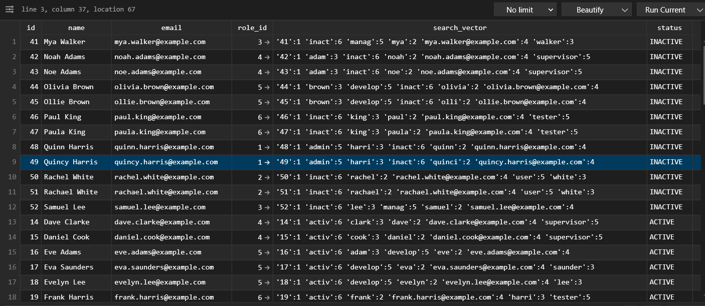

# postgres_ts_vector_full_text_search
Example microservice for spring boot and ts vector search with postgres

## How ts vector index looks like


## How to handle ts vector index when a new column is added

- Add/Update/Delete the new column
```shell
ALTER TABLE users ADD COLUMN status VARCHAR(10) NOT NULL;
```
- Update the ts vector index
```shell
-- Update the trigger function to include new columns
DROP FUNCTION IF EXISTS users_search_vector_update() CASCADE;

CREATE FUNCTION users_search_vector_update() RETURNS trigger AS $$
BEGIN
    NEW.search_vector := to_tsvector('english',
        NEW.id::text || ' ' ||
        NEW.name || ' ' ||
        NEW.email || ' ' ||
        coalesce((SELECT role_name FROM roles WHERE id = NEW.role_id), '') || ' ' ||
        NEW.status
    );
    RETURN NEW;
END
$$ LANGUAGE plpgsql;

-- Re-create trigger
DROP TRIGGER IF EXISTS tsvectorupdate ON users;

CREATE TRIGGER tsvectorupdate
BEFORE INSERT OR UPDATE ON users
FOR EACH ROW EXECUTE FUNCTION users_search_vector_update();

-- Populate search_vector for existing rows
UPDATE users u
SET search_vector = to_tsvector('english',
    u.id::text || ' ' || u.name || ' ' || u.email || ' ' ||
    coalesce(r.role_name,'') || ' ' || u.status)
FROM roles r
WHERE u.role_id = r.id;

-- Ensure GIN index exists
CREATE INDEX IF NOT EXISTS idx_users_search_vector
ON users USING GIN(search_vector);
```